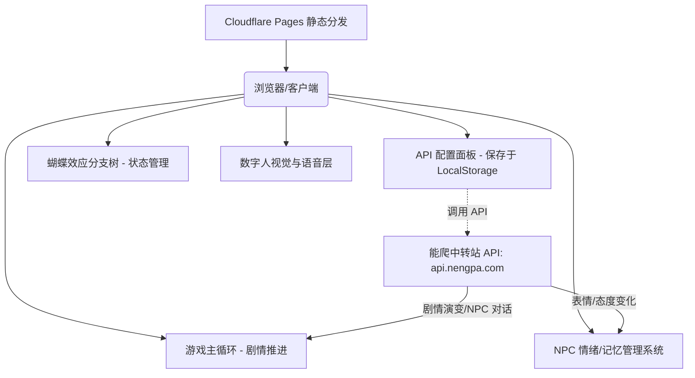

# 时光回溯沙盒：AI 驱动的平行人生 RPG 系统设计方案

本方案旨在设计一个基于大语言模型（LLM）驱动、支持时空回溯分支图、动态 NPC 表情记忆和拟真数字人语音的童年成长模拟文字 RPG 游戏。

---

## 1. 系统架构设计

系统采用**纯前端单页应用（SPA）**架构开发，无后端服务器需求，完全兼容并适配部署至 **Cloudflare Pages**。



### 为什么选择该架构？
1. **零成本与高并发**：Cloudflare Pages 静态网页托管完全免费，没有带宽限制，极易推广。
2. **密钥绝对安全**：用户的 API Key 保存在浏览器本地（LocalStorage），请求直接由客户端发送到中转站，不经过任何中间服务器，彻底杜绝泄露风险。
3. **极佳的可移植性**：游戏状态、人生分支轨迹和 API 配置均存在本地，支持一键导出/导入游戏存档。

---

## 2. 核心功能设计

### 2.1 蝴蝶效应分支树（时空回溯）
游戏右侧常驻一个可视化的“人生轨迹树”。
- **节点数据结构**：
  ```typescript
  interface LifeNode {
    id: string;             // 节点唯一ID
    parentId: string | null;// 父节点ID
    age: number;            // 当前岁数/阶段
    title: string;          // 事件简短描述 (如 "弄丢钢笔")
    playerAction: string;   // 玩家做出的选择
    storyText: string;      // AI 生成的剧情段落
    npcStates: Record<string, NpcState>; // 此时各NPC的状态
    playerStats: PlayerStats;            // 此时玩家的性格/属性
    children: string[];     // 子节点ID列表
  }
  ```
- **回溯机制**：玩家可以随时在树状图上点击任何一个经历过的历史节点，选择“吃下后悔药”。系统将从该节点分裂出一个新的分支节点，玩家可选择另一个行为，开启平行人生。

### 2.2 半开放式交互机制
每次剧情演绎完毕后，界面为玩家呈现：
1. **3个推荐选项**：由 AI 根据当前的剧情和 NPC 状态动态生成。
2. **1个自定义输入框**：“我想这样做...”，允许玩家输入任意天马行空的行动，提交给 AI 解释。

### 2.3 动态 NPC 表情与记忆系统
我们预设 3 个童年核心人物：
- **林素琴 (母亲)**：望子成龙、严厉但内心深沉地爱你。
- **张小胖 (发小)**：有些懦弱、贪吃但为人仗义，总是无条件支持你。
- **苏清婉 (同桌)**：性格内敛、成绩优异，对你有些微妙的朦胧好感。

**NPC 的状态属性 (NpcState)**：
- **好感度 (Affection)**：0-100 范围，影响对话的亲密程度和结局走向。
- **亲密度 (Trust)**：0-100 范围，影响 NPC 是否会对玩家吐露心声。
- **当前情绪 (Emotion)**：如 `neutral`（平静）、`happy`（高兴）、`angry`（生气）、`sad`（难过）、`surprised`（惊讶）。
- **记忆库 (Memory)**：由 AI 在剧情生成时自动提取的 NPC 重要情感记忆片段（如 "玩家曾为我顶撞老师"）。

### 2.4 数字人视觉与拟真语音层
- **动态立绘**：
  - 针对 3 位主要 NPC，我们在前端绘制或载入精美透明背景半身像。
  - 使用 CSS 关键帧动画实现**微重力呼吸起伏**与**眨眼效果**。
  - 立绘会根据 `Emotion` 属性动态切换对应的五官表情。
- **拟真语音**：
  - 每次 NPC 说话时，使用浏览器自带 of Web Speech API。
  - 在浏览器内置的中文语音包中寻找声音（例如选择“Microsoft Xiaoxiao”或类似的温暖女声模拟同桌，选择“Microsoft Yaoyao”或带有一些成熟质感的成熟女声模拟母亲）。
  - 实现**文字流式打字效果 (Typewriter Effect) 与语音同步**，提供逼真的交互体验。

---

## 3. AI 对接与多渠道配置中心 (服务开源)

为了方便项目开源以及全球不同用户低门槛接入体验，游戏内置一个灵活的 **AI 多渠道配置面板 (AI Settings Panel)**。

### 3.1 支持的接入方式
1. **预设渠道 (Presets)**：
   - **能爬中转站 (api.nengpa.com)**：默认包含 `MiniMax-M2.7`, `MiniMax-M2.5` 等推荐模型。
   - **DeepSeek 官方 API**：内置 `deepseek-chat`。
   - **OpenAI 官方 API**：内置 `gpt-4o`, `gpt-4o-mini`。
   - **自定义中转站 (Custom)**：自动兼容任何遵循 OpenAI SDK 格式的 API 代理。
2. **完全自定义配置项**：
   - **API 接口地址 (Base URL)**：支持输入任意自定义 API 基地址（如 `https://api.nengpa.com/v1` 或玩家本地运行的局部大模型端口）。
   - **自定义模型 ID (Model ID)**：支持自由键入模型代号。
   - **API Key**：用户自主提供，在网页中填入。
   
### 3.2 隐私与安全协议
- **本地化隐私**：所有 API 密钥均保存在客户端浏览器 LocalStorage 中。
- **纯客户端请求**：所有的 AI 推演请求通过 `fetch` 或 `openai` 客户端库直接从玩家浏览器发起，不经过任何游戏托管服务器，绝对安全，零数据泄露隐患。

### 3.3 剧情推演 Prompt (系统设定)

```
你是一个充满哲理与怀旧情感的童年成长RPG游戏主持人(DM)。玩家将通过你回到童年，面对曾经后悔的时刻，做出新选择以改变人生轨迹。
你必须实时根据世界状态、玩家当前性格属性和NPC的态度，生成下一步剧情。

请始终使用 JSON 格式回复，格式如下：
{
  "storyText": "（300字左右的高质量童年剧情描写，融入环境与NPC的言行细节）",
  "playerStatsChange": {
    "courage": 2, // 勇气值改变 (可为正负)
    "honesty": -1, // 诚实值改变
    "empathy": 1   // 共情力改变
  },
  "npcStatusChanges": {
    "mother": { "affection": 5, "trust": 2, "emotion": "happy" },
    "classmate": { "affection": -3, "trust": -5, "emotion": "sad" }
  },
  "options": [
    "选项1内容...",
    "选项2内容...",
    "选项3内容..."
  ]
}
```

---

## 4. 视觉与排版设计

- **色调系统**：
  - **背景**：柔和、温润的米白色/羊皮纸材质复古底色（`#fcfaf2`），辅以浅卡其色质感阴影。
  - **主题色**：回忆感的**留白墨绿**（`#2d573d`） and **余晖暖橘**（`#e07a5f`）。
  - **暗色模式**：深空蓝与微光紫色调，代表“深夜的梦境与回溯”。
- **特效**：
  - 当点击“后悔药”进行时空回溯时，整个网页执行 CSS 滤镜动画（高斯模糊 + 灰度化 + 倒转旋涡动效），展现“时间倒流”的震撼感。
- **立绘呈现**：NPC 立绘悬浮于对话框上方/侧边，伴有微光投影和呼吸动效。

---

### 2.5 存档与数据管理系统 (自动存盘与社交分享)

为兼顾“防丢”和“开源社区分享”两大核心诉求，我们设计了双轨制存档机制：

1. **LocalStorage 实时自动存档**：
   - 游戏进程中，系统会在每次触发“做决策”、“剧情推演结束”、“进行时空回溯”等动作时，自动将当前完整状态（包括 `LifeNode[]` 树结构、当前所在节点 ID、主角性格属性、NPC 表情/好感度/记忆等）序列化为 JSON，并保存至 `localStorage.setItem('game_life_save', JSON.stringify(saveData))`。
   - 玩家刷新网页或下次重新进入时，系统会自动读取并还原状态，无需手动存档。

2. **JSON 文件导入/导出 (社交与备份)**：
   - **一键导出**：提供“导出人生”按钮，允许玩家将当前的平行人生轨迹树及属性数据打包下载为 `.json` 格式的本地文件。
   - **一键导入**：提供“导入人生”按钮，支持读取本地 `.json` 存档。玩家可以把自己的多重人生分支存档分享给朋友，朋友导入后即可完整复现你的整棵剧情树，并在你的任意选择分支上“吃后悔药”继续玩。这极富社区传播与可玩性！

---

## 5. 跨域 CORS 代理与 Cloudflare 部署优化设计

### 5.1 痛点分析与挑战
当浏览器纯前端单页应用（SPA）直接使用 `fetch` 访问大模型中转站 API（例如 `https://api.nengpa.com/v1/chat/completions`）时，往往会触发以下限制：
1. **CORS 跨域安全策略拦截**：由于大模型厂商或部分中转服务商未在其 HTTP 响应中配置 `Access-Control-Allow-Origin: *`，导致浏览器安全机制拦截该网络返回，造成 `Failed to fetch` 崩溃。
2. **API 密钥暴露风险**：在公网传输中，直连可能会增加密钥泄露或网络连接稳定性隐患。

### 5.2 零配置双通道动态代理方案
为了提供无缝的游戏体验，同时确保安全性，系统采用“双通道同源动态代理机制”：
- **同源前台地址**：前台发起的 API 统一请求至同源的 `/api-proxy/chat/completions`，并附带自定义头部 `x-target-url`（其值为实际的 API Base URL）。
- **本地开发通道**：新建 `vite.config.js`。利用 Vite 内部开发服务器的 `http-proxy` 中间件，动态提取请求头中携带的 `x-target-url` 并将请求转发，解决本地开发时的 CORS 问题。
- **线上部署通道**：针对 Cloudflare Pages 部署，在根目录新建 `/functions/api-proxy/[[path]].js`。Cloudflare Pages 在构建时会自动将其编译为 Cloudflare Workers 同源服务，负责动态提取 `x-target-url` 头并将请求转发给目标 API 节点，从而完美避开任何 CORS 限制且不需要玩家折腾。

